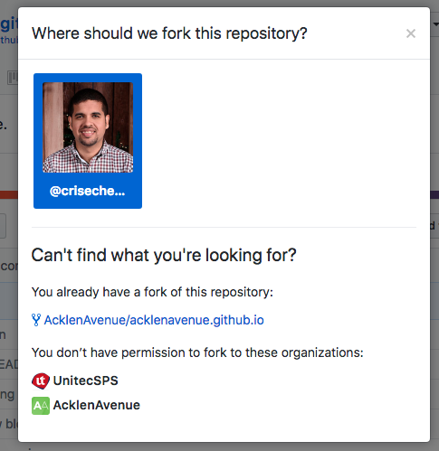

# acklenavenue.github.io

The AcklenAvenue official website.

## Add New Acklener Information 
In order to complete this task you need to have a GitHub account, If you have one then Sign in. If you don’t have an account then you need to create one by clicking Sign up.

1.	Now you need to **Fork** the repository, in order to do that click on the fork button

2. Once inside the forked repository click on **_data** folder

3. Inside _data folder click on file named **team.json** and it shows you a list of all the Ackleners. This is the file that you need to _edit_ in order to add your information to Acklen Avenue site, to edit the file click on the _pencil_ icon as shown on the image bellow

4. Now you have to scroll to the bottom of the file and select the information of the last Acklener on the list in order to _Copy_ his information as a guide for your own information.

5. Once you have _Copied/Pasted_ the info, you need to replace it with your own information. Replace the text **–Add Your Name—** with your personal information and so on.

6. Once you added your information you have to **Commit** those changes to the repository

7. After that you ‘ll be redirected to another page in order to **Create a New Pull Request**.

8. Congratulations!, you have successfully added yourself to Acklen Avenue website.

If you had any problem with this guide please reach to an Acklen Avenue developer for support.

