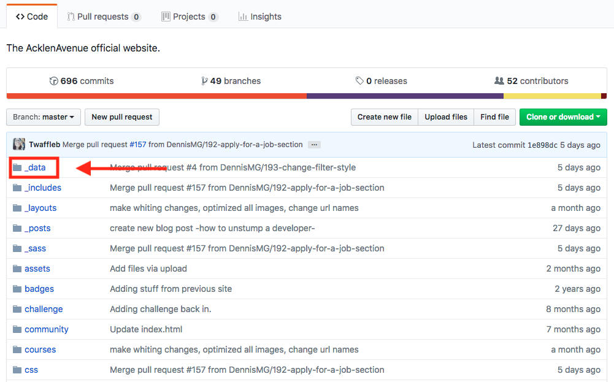
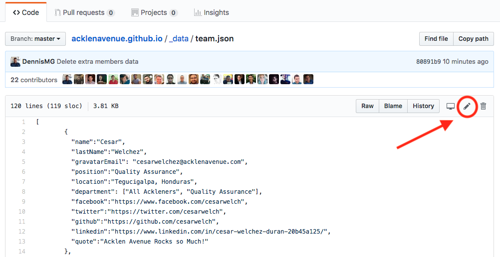
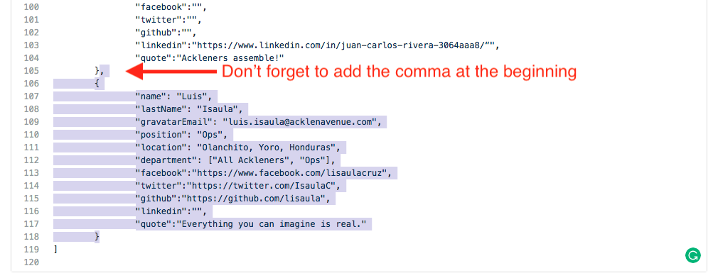
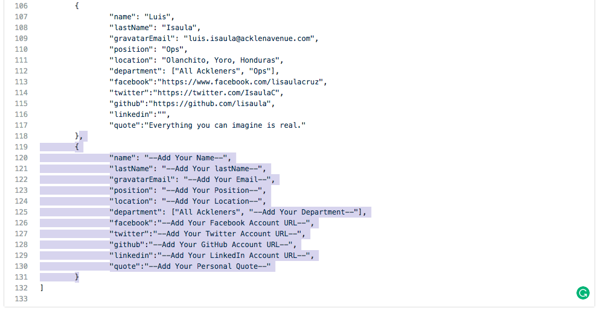
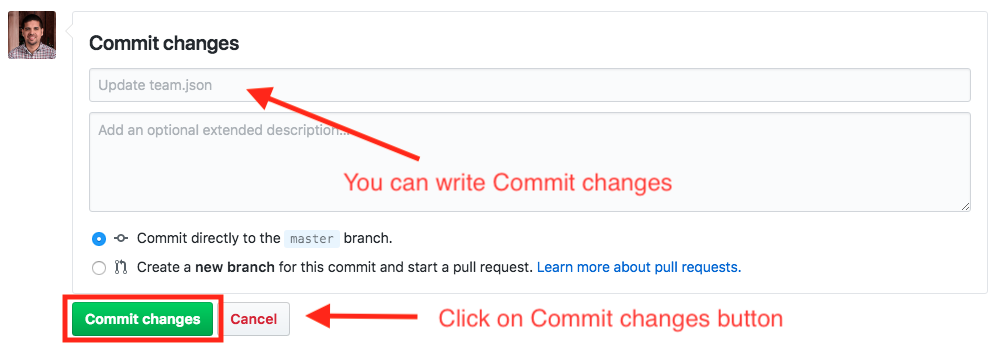
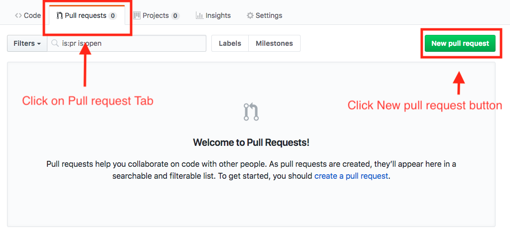
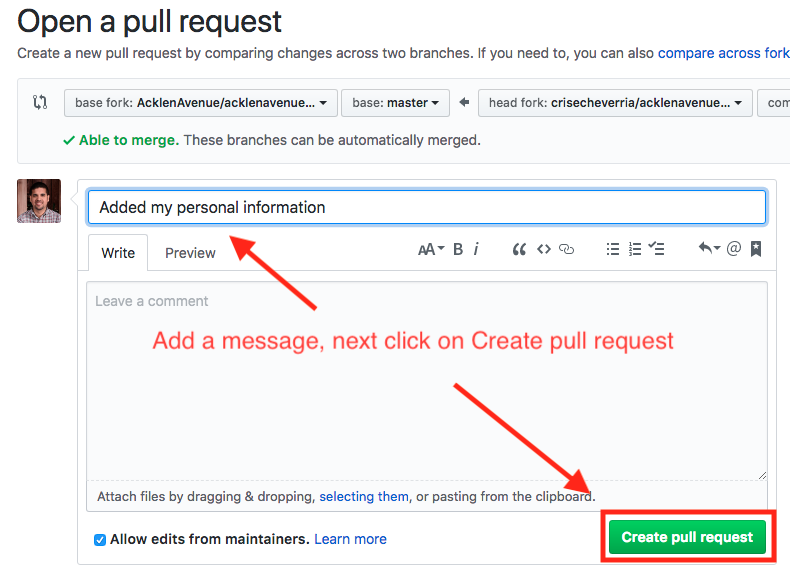
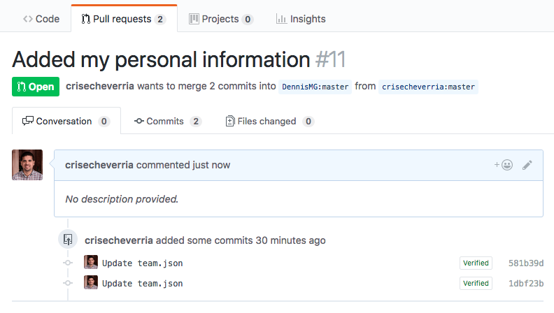

The AcklenAvenue official website.

## Add New Acklener Information 
In order to complete this task you need to have a GitHub account, If you have one then Sign in. If you don’t have an account then you need to create one by clicking Sign up. If you had any problem with this guide please reach to an Acklen Avenue developer for support.
<br/>
<br/>
1.	Now you need to **Fork** the repository, in order to do that, click on the fork button.


<br/>
<br/>
2. Now a popup will display, select your profile image/gravatar to confirm where to Fork.


**NOTE:** if you see a message saying *"You already have a fork of this repository"* (like in the image above) you'll have to delete that fork and comeback to this step later.
<br/>

In order to delete the forked repository, follow next steps **(this is just in case you already forked Acklen Avenue repository before. If this is your first time forking Acklen Avenue repository ignore this steps and follow from step 3):**
<br/>
2.1 Inside **Your Forked** version of Acklen Avenue repository, click on the **Settings** tab, as shown on image:


<br/>
2.2 Now, scroll down tho the bottom of the repository to **Danger zone** area, and click to the button **Delete this repository**:


<br/>
2.3 Follow the steps in order to confirm the delete of your forked version of Acklen Avenue repository:


<br/>
<br/>
3. Once inside the forked repository click on **_data** folder



<br/>
<br/>
4. Inside _data folder click on file named **team.json** and it shows you a list of all the Ackleners. This is the file that you need to _edit_ in order to add your information to Acklen Avenue site, to edit the file click on the _pencil_ icon as shown on the image below



<br/>
<br/>
5. Now you have to scroll to the bottom of the file and select the information of the last Acklener on the list in order to _Copy_ his information as a guide for your own information.



Here's an example of the code you have to copy, just replace your information and **don't forget** the comma as shown in the image above
```
{
  "name": "<-Your information->",
  "lastName": "<-Your information->",
  "gravatarEmail": "<-Your information->",
  "position": "<-Your information->",
  "location": "<-Your information->",
  "department": ["All Ackleners", "<-Your Department->"],
  "facebook": "<-Your information->",
  "twitter": "<-Your information->",
  "github": "<-Your information->",
  "linkedin": "<-Your information->",
  "quote": "<-Your information->!"
}
```
<br/>
<br/>
6. Once you have _Copied/Pasted_ the info, you need to replace it with your own information. Replace the text **–Add Your Name—** with your personal information and so on.



<br/>
<br/>
7. Once you added your information you have to **Commit** those changes to the repository



<br/>
<br/>
8. After that you need to click on **Pull request** TAB and click the green button in order to create a **New Pull Request**.



<br/>
<br/>
9. Comparing changes: Make sure that the base fork is AcklenAvenue, then click **Create pull request** button


<br/>
<br/>
10. Add a message for your pull request and Click button **Create pull request**



<br/>
<br/>
11. Congratulations!, you have successfully created a New pull request in order to add yourself to Acklen Avenue website.




